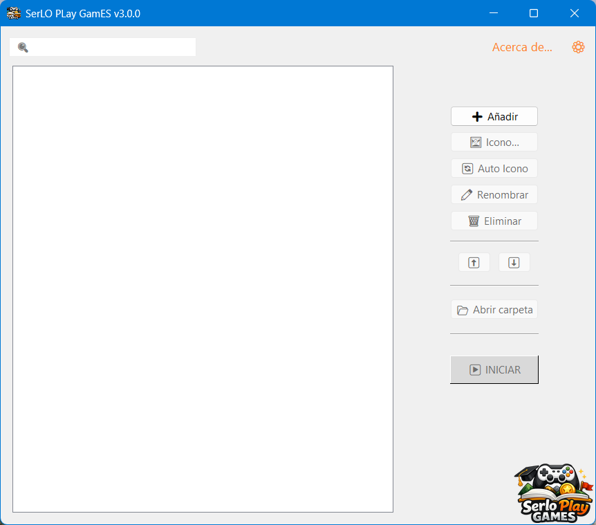
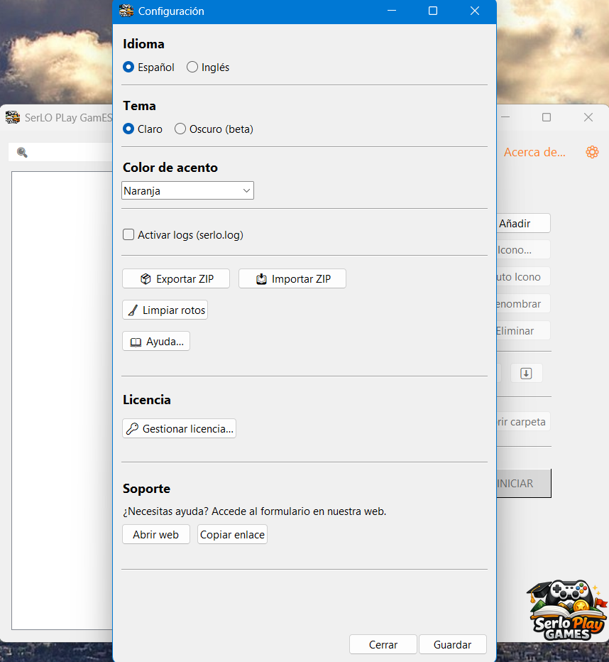
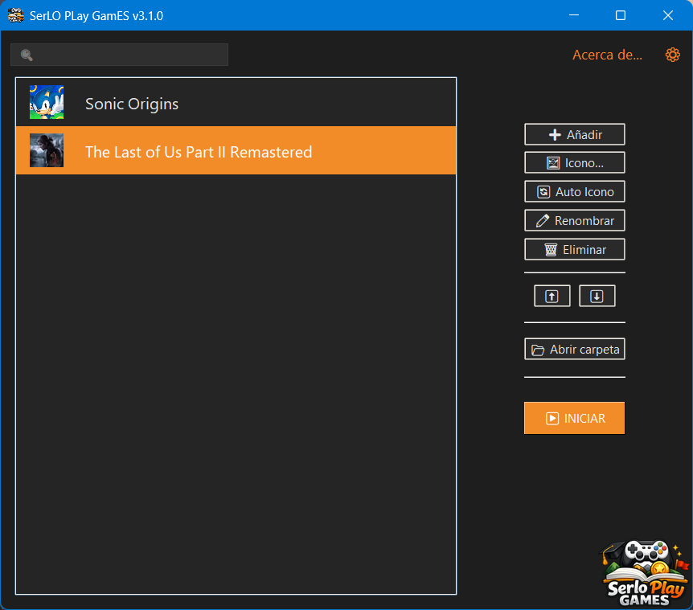
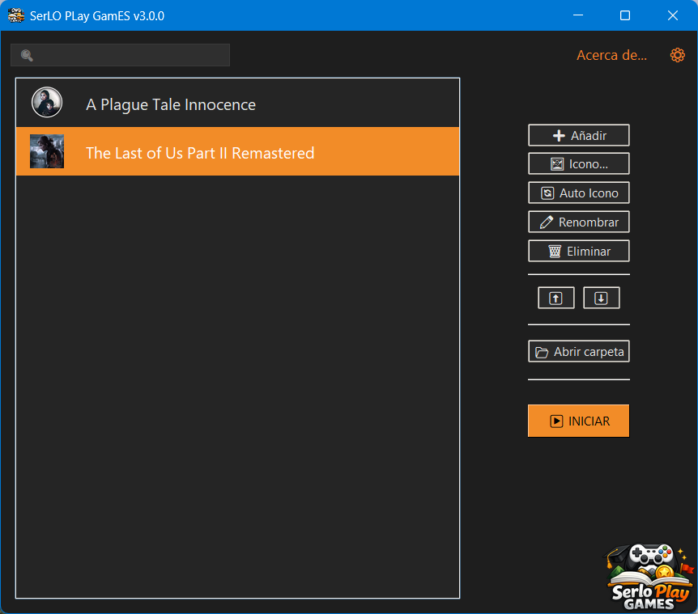

  

<h1 align="center">SerLO PLay GamES</h1>

  🚀 Advanced launcher with automatic game search, icon system, Steam support, and accent colors

  Organize and launch your games and applications from one place

  

  
  

  <a href="#-español">🇪🇸 Español</a> · <a href="#-english">🇬🇧 English</a>

---

#### 🇪🇸 Español

## 🧩 ¿Qué es?

SerLO PLay GamES es un launcher portable para Windows que permite organizar, lanzar y personalizar juegos, accesos directos y aplicaciones desde un solo lugar.

Compatible con `.exe`, `.lnk` y `.url`, incluyendo integración con Steam.

---

## ⚙️ Características

- Launcher portable y ligero, sin instalación
- Gestión sencilla de juegos y aplicaciones
- 🔎 Búsqueda automática de juegos instalados
- Revisión de las carpetas habituales de Steam, Epic Games, EA, Ubisoft, GOG y Xbox
- Carpetas de búsqueda personalizables desde Configuración
- Selección de los juegos encontrados antes de añadirlos
- Los juegos también se pueden seguir añadiendo manualmente
- El programa también intenta asignarles un icono automáticamente
- Sistema de iconos automático y optimizado
- Iconos personalizados por juego o aplicación
- 🎨 Sistema de colores de acento en la interfaz
- Tema claro y oscuro
- 🔍 Buscador integrado de la biblioteca
- 📦 Exportar / importar configuración mediante ZIP
- 🌍 Multiidioma: Español / Inglés

---

## 🖼️ Capturas

  
  

  
  

---

## 📥 Descarga

[Descargar última versión](https://github.com/serlortrademark/serloplaygames/releases/latest)

---

## 🌐 Web oficial

https://serloplaygames.pages.dev

---

## 💻 Requisitos

- Windows 10
- Windows 11

---

#### 🇬🇧 English

## 🧩 What is it?

SerLO PLay GamES is a portable launcher for Windows that lets you organize, launch, and customize games, shortcuts, and applications from one place.

Compatible with `.exe`, `.lnk`, and `.url`, including Steam integration.

---

## ⚙️ Features

- Portable and lightweight launcher, no installation required
- Easy management of games and applications
- 🔎 Automatic search for installed games
- Checks common Steam, Epic Games, EA, Ubisoft, GOG and Xbox folders
- Custom search folders can be configured from Settings
- Choose which detected games you want to add
- Games can still be added manually
- The program also tries to assign icons automatically
- Optimized automatic icon system
- Custom icons for each game or application
- 🎨 Accent color system for the interface
- Light and dark theme
- 🔍 Built-in library search
- 📦 Export / import configuration via ZIP
- 🌍 Multilingual: Spanish / English

---

## 🖼️ Screenshots

  
  

  
  

---

## 📥 Download

[Download latest version](https://github.com/serlortrademark/serloplaygames/releases/latest)

---

## 🌐 Official Website

https://serloplaygames.pages.dev

---

## 💻 Requirements

- Windows 10
- Windows 11
